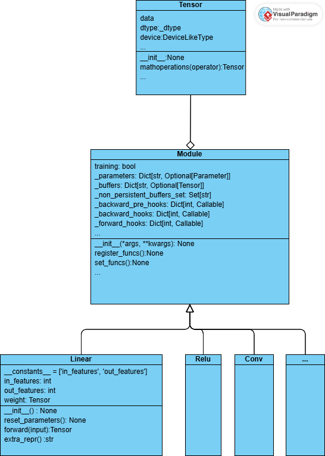

# 引言

Pytorch——业界最受欢迎的AI库之一。其易用性和强大而丰富的功能都使得其广受人们的好评。由于篇幅所限，本文主要集中注意力于torch中的tensor相关操作的实现和torch.nn内各个模块之间的关系，对这些代码展开分析。

我们的分析主要将分为以下几个部分，围绕着以下几个问题来展开：

1. pytorch是如何基于python实现tensor的？tensor是怎么存储的？tensor是如何实现操作（如矩阵乘、reshape、transpose等）的？

2. tensor是如何与其他模块联动的？如何实现前向传播的参与、自动求导和反向更新？

3. torch/nn路径下的各个模块的组织结构是怎样的？每一个模块如何实现以方便管理、修改和调用？

4. 当我们调用其中的模块的时候究竟发生了什么？

5. nn.Module是如何支持可扩展性的？当我们在自己的神经网络中增加某一层的时候具体发生了什么？

由于我们是面向对象课，因此我们的关注点将主要集中于问题2、3、5，其余问题将当做扩展放于最后。

让我们以一段简单的代码开始。这段代码包含了两个线性层和一个relu层，以SGD作优化器和MSELoss计算损失，并进行了一轮前向传播和反向传播：
```python
import torch
import torch.nn as nn
import torch.optim as optim

# Define a simple neural network
class SimpleNN(nn.Module):
    def __init__(self):
        super(SimpleNN, self).__init__()
        self.fc1 = nn.Linear(10, 50)
        self.relu = nn.ReLU()
        self.fc2 = nn.Linear(50, 1)

    def forward(self, x):
        x = self.fc1(x)
        x = self.relu(x)
        x = self.fc2(x)
        return x

# Create an instance of the neural network
model = SimpleNN()

# Define a loss function and an optimizer
criterion = nn.MSELoss()
optimizer = optim.SGD(model.parameters(), lr=0.01)

# Dummy input and target tensors
input_tensor = torch.randn(1, 10)
target_tensor = torch.randn(1, 1)

# Forward pass
output = model(input_tensor)
loss = criterion(output, target_tensor)

# Backward pass and optimization
optimizer.zero_grad()
loss.backward()
optimizer.step()

print(f'Output: {output}')
print(f'Loss: {loss.item()}')
```

让我们以debug的形式一步一步地看看它发生了什么：

1. 在simpleNN类的初始化时，其先调用其父类nn.Module的初始化函数，调用地点位于`torch/nn/modules/module.py`中的Module类的`__init__`函数：
```python
        super(SimpleNN, self).__init__()
```
```python
def __init__(self, *args, **kwargs) -> None:
        """Initialize internal Module state, shared by both nn.Module and ScriptModule."""
        torch._C._log_api_usage_once("python.nn_module")

        # Backward compatibility: no args used to be allowed when call_super_init=False
        if self.call_super_init is False and bool(kwargs):
            raise TypeError(f"{type(self).__name__}.__init__() got an unexpected keyword argument '{next(iter(kwargs))}'"
                            "")

        if self.call_super_init is False and bool(args):
            raise TypeError(f"{type(self).__name__}.__init__() takes 1 positional argument but {len(args) + 1} were"
                            " given")

        """
        Calls super().__setattr__('a', a) instead of the typical self.a = a
        to avoid Module.__setattr__ overhead. Module's __setattr__ has special
        handling for parameters, submodules, and buffers but simply calls into
        super().__setattr__ for all other attributes.
        """
        super().__setattr__('training', True)
        super().__setattr__('_parameters', OrderedDict())
        super().__setattr__('_buffers', OrderedDict())
        super().__setattr__('_non_persistent_buffers_set', set())
        super().__setattr__('_backward_pre_hooks', OrderedDict())
        super().__setattr__('_backward_hooks', OrderedDict())
        super().__setattr__('_is_full_backward_hook', None)
        super().__setattr__('_forward_hooks', OrderedDict())
        super().__setattr__('_forward_hooks_with_kwargs', OrderedDict())
        super().__setattr__('_forward_hooks_always_called', OrderedDict())
        super().__setattr__('_forward_pre_hooks', OrderedDict())
        super().__setattr__('_forward_pre_hooks_with_kwargs', OrderedDict())
        super().__setattr__('_state_dict_hooks', OrderedDict())
        super().__setattr__('_state_dict_pre_hooks', OrderedDict())
        super().__setattr__('_load_state_dict_pre_hooks', OrderedDict())
        super().__setattr__('_load_state_dict_post_hooks', OrderedDict())
        super().__setattr__('_modules', OrderedDict())

        if self.call_super_init:
            super().__init__(*args, **kwargs)
```

nn.Module内包含了很多变量在初始时声明，在此通过调用变量的上层类的`__setattr__`方法去初始化其值。

1. 初始化对应层的类，让我们以nn.Linear来展开分析，其同样位于modules文件夹中，文件名为Linear，规模为百行。
```python
        self.fc1 = nn.Linear(10, 50)
        self.relu = nn.ReLU()
        self.fc2 = nn.Linear(50, 1)
```
```python
    def __init__(self, in_features: int, out_features: int, bias: bool = True,
                 device=None, dtype=None) -> None:
        factory_kwargs = {'device': device, 'dtype': dtype}
        super().__init__()
        self.in_features = in_features
        self.out_features = out_features
        self.weight = Parameter(torch.empty((out_features, in_features), **factory_kwargs))
        if bias:
            self.bias = Parameter(torch.empty(out_features, **factory_kwargs))
        else:
            self.register_parameter('bias', None)
        self.reset_parameters()
```

Linear同样是Module的子类，在其之上添加了in_features : int和out_feature : int和weight : Tensor。若传参时bias == True，则添加bias : Tensor类型。
```python
    def reset_parameters(self) -> None:
        # Setting a=sqrt(5) in kaiming_uniform is the same as initializing with
        # uniform(-1/sqrt(in_features), 1/sqrt(in_features)). For details, see
        # https://github.com/pytorch/pytorch/issues/57109
        init.kaiming_uniform_(self.weight, a=math.sqrt(5))
        if self.bias is not None:
            fan_in, _ = init._calculate_fan_in_and_fan_out(self.weight)
            bound = 1 / math.sqrt(fan_in) if fan_in > 0 else 0
            init.uniform_(self.bias, -bound, bound)
```

当初始化参数结束时调用reset_parameters方法，将weight按照kaiming_uniform分布进行初始化，将bias按照uniform分布进行初始化，防止初始化为0可能导致的难以到达最小值、神经元死亡等问题。

3. 初始化criterion，MSEloss同样是Module的子类，过程和上面比较类似，此处从略。
4. 初始化optimizer为SGD实例，该类位于`torch/optim/SGD`路径下，在此我们调用`model.parameters()`方法将神经网络参数传入optimizer，以便以后的梯度计算和参数更新。
```python
optimizer = optim.SGD(model.parameters(), lr=0.01)
```
5. 前向传播获得output：在此直接给model传参数会使得控制来到Module模块的`_wrapped_call_impl`进而进入`_call_impl`函数，它使得控制回到自定义模块中的`forward`方法。类似地，`criterion()`因为是Module子类MSELoss的实例化因此它也可以以类似的方法调用`forward`函数。
```python
output = model(input_tensor)
loss = criterion(output, target_tensor)
```
```python
    __call__: Callable[..., Any] = _wrapped_call_impl
    def _wrapped_call_impl(self, *args, **kwargs):
        if self._compiled_call_impl is not None:
            return self._compiled_call_impl(*args, **kwargs)  # type: ignore[misc]
        else:
            return self._call_impl(*args, **kwargs)
    def _call_impl(self, *args, **kwargs):
        forward_call = (self._slow_forward if torch._C._get_tracing_state() else self.forward)
        # If we don't have any hooks, we want to skip the rest of the logic in
        # this function, and just call forward.
        if not (self._backward_hooks or self._backward_pre_hooks or self._forward_hooks or self._forward_pre_hooks
                or _global_backward_pre_hooks or _global_backward_hooks
                or _global_forward_hooks or _global_forward_pre_hooks):
            return forward_call(*args, **kwargs)
```
反向传播：调用对应模块内定义好的函数，此处不再解释。
```python
optimizer.zero_grad()
loss.backward()
optimizer.step()
```
从上面的例子中，我们不难看到，我们最常用的模块是以torch.nn.Module类为核心，将不同类型的模块作为Module类的子类进行扩展。作为父类，Module类似容器，需要保证参数的装载、子类方法的调用等；作为子类，Linear、ReLu等对Module进行进一步的包装，保证了正确的初始化、正确的前向传播等。

# 主要功能分析与建模

## 需求简述

所谓深度学习语言框架，其最重要的需求莫过于对参数的储存、更新、梯度计算的支持和对存储参数的神经网络层的自定义的支持。让我们先来明确一下一个常规的神经网络训练并得到结果的全过程：

1. 初始化神经网络。每一个神经网络层包含各自的参数，定义并封装了该类型对应的forward和backward函数。
2. 初始化每个神经网络中的参数，即初始化每个层中的Tensor，如线性层(nn.Linear)中包含的weight和bias等（这一步其实随着步骤一一起进行）。
3. 以训练样本作为输入从最开始的神经网络层开始，每一层通过forward函数生成新的tensor，新的tensor再接着进入下一个神经网络层。
4. 得到训练结果后，与标准结果做对比，通过loss函数计算损失，并调用backward和grad方法等计算并更新每一层中的Tensor。

如此循环往复，直到结束。

## 需求分析

让我们从成功系统的属性的角度来分析：

1. 层次结构：在层次结构上，Tensor属于最底层的层次。其被nn.Module以及以此为基础的一系列model使用。同时，nn.Module也作为其他模型的底层，作为torch/nn路径下一系列模型类的统一父类，这里体现了多态的思想，保证了复用性。
2. 关注点分离：Tensor类负责执行参数的保存、运算等，而nn.Module则对一个model的实现提供基本的支持，如准备好一个模型可能拥有的Tensor等参数的存放空间，而对于一个具体的model（如nn.Linear）则负责forward函数、backward函数等的具体实现，可更新参数的规定等。

概括而言之，Tensor与Module存在依赖关系，而Module与Linear等模型则存在泛化（继承）关系。

依据前文的分析建模如下：
```
[用例名称]
    Tensor
[主要接口]
    __init__
    计算函数
[用例描述]
    1.调用者调用__init__，将其他类型的量（如List，numpyArray等）转化为Tensor。
    2.调用者调用计算函数如grad，tan，exp，matmul等，更新Tensor的值。
```

tensor的接口种类繁杂，数量庞大，但大部分都是各种对tensor的数学计算操作，因此此处仅以“计算函数”进行一个笼统概括。该类接口以及接口注释均定义于`torch/_C/_VariableFunctions.pyi`文件中，具体实现则主要集中于`torch/csrc`下的c++文件中，通过pybind将其绑定到python，此处不再详述。

```
[用例名称]
    Module
[主要接口]
    __init__
    设置函数
    注册函数
[用例描述]
    1. 调用者调用__init__，创建一个空白的model。
    2. 提供对模型通用的参数的支持，比如模型中的参数（_Parameters:Dict），模型是否处于训练模式(training)等。
    3. 提供设置函数和注册函数(如train函数和register_*系列函数等)，使得调用者可以自定义个性化参数和方法。
```

在Module中大部分接口均为对其参数的设置，比如`training`函数的作用即将模块设置为训练模式（参数training = true），`register_parameter`函数的作用则为给模型添加新的参数parameter等。这与Module的特性相符：所有model的公用父类，因此其不能包含任何个性化的东西，同时也应当给所有个性化的操作准备好接口。

接下来以nn.Linear为代表来尝试阐明以Module为基础的model的基本信息。
```
[用例名称]
    Linear
[主要接口]
    __init__
    forward
    resetparameter
[用例描述]
    1. 调用者调用__init__，并传入参数
    2. Linear接受参数，将infeature、outfeature、weight、bias存放于模块中的对应位置。
    3. 当训练中接收到参数时，Linear调用自己在模块内定义好的forward函数，获得输出。
```

以此简单绘制类图如下：



以下省略复杂的类中属性及方法，整体架构一览如下：


# Tensor核心设计流程分析

## 实际执行流程

让我们以一段简单的代码开始：
```python
import torch

a = torch.tensor([1, 2, 3])
print(a)
```
当我们调用`torch.tensor`时，发生了什么呢？由于tensor的底层实现是由C++实现的，这给我们的追溯带来了难度，具体如下：
Tensor类（位于`torch/_tensor.py`目录下），其constructor为C++实现，位于路径`torch/csrc/utils/tensor_new.cpp`中，具体代码以及逐行分析如下：
```C++
//TODO:(code reading) route 1.2: tensor_ctor
Tensor tensor_ctor(
    c10::DispatchKey dispatch_key,//用于调度的键
    at::ScalarType scalar_type,//张量的标量类型
    PythonArgs& r) {//包含参数的pythonargs对象
  if (r.idx == 0) {//若参数为数据
    PyObject* data = r.pyobject(0);//获取第一个数据
    if (THPVariable_Check(data)) {//检查类型为data
      auto ret = PyErr_WarnEx(
          PyExc_UserWarning,
          "To copy construct from a tensor, it is recommended to use sourceTensor.clone().detach() "
          "or sourceTensor.clone().detach().requires_grad_(True), rather than torch.tensor(sourceTensor).",
          1);//发出警告
      if (ret != 0)
        throw python_error();
    }
    //以下为PythonArgs类中对应位置的参数
    bool type_inference = r.isNone(1);//类型推断
    bool pin_memory = r.toBool(3);//是否固定内存
    bool args_requires_grad = r.toBool(4);//是否需要梯度
    //创建一个新的张量
    // TODO:(code reading):internal_new_from_data的实现
    auto new_tensor = internal_new_from_data(
        typeIdWithDefault(r, 2, dispatch_key),
        r.scalartypeWithDefault(1, scalar_type),
        r.deviceOptional(2),
        data,
        /*copy_variables=*/true,
        /*copy_numpy=*/true,
        /*type_inference=*/type_inference,
        pin_memory);
    // 第五个参数：可选的维度名称列表
    auto names = r.toDimnameListOptional(5);
    if (names) {//若非空
      at::namedinference::propagate_names(
          new_tensor, *names, /*validate_names=*/true);
    }
    //保证叶节点
    new_tensor.detach_(); // ensure new_tensor a leaf node
    //设置是否需要梯度
    // TODO:(code reading)检查求梯度在pytorch中是如何实现的
    new_tensor.set_requires_grad(args_requires_grad);
    return new_tensor;
  }
  throw std::runtime_error("tensor(): invalid arguments");
}
```
真正的核心位置在于`internal_new_from_data`中。对应代码与逐行分析如下：
```python
# xref: internal_new_from_data in torch/csrc/utils/tensor_new.cpp
def _internal_new_from_data(
    options,
    scalar_type,
    device_opt,
    data,
    copy_variables,
    copy_numpy,
    type_inference,
    pin_memory=False,
):
    if isinstance(data, torch.Tensor):# 检查data是否已经是一个Tensor了
        # 不能固定从变量构造的张量的内存，因此报错
        torch._check(
            not pin_memory, lambda: "Can't pin tensor constructed from a variable"
        )
        # 如果能复制则直接调detach方法创建新张量（对应了前面抛出的warning）
        var = data
        if copy_variables:
            var = var.detach()
        # 如果type_inference为True，则推断标量类型，否则使用提供的scalar_type。如果device_opt不为None，则使用它，否则使用变量的设备。
        inferred_scalar_type = var.dtype if type_inference else scalar_type
        device = device_opt if device_opt is not None else var.device
        # 返回新的张量（包含device信息，类型信息，可复制信息等）
        return var.to(
            device=device,
            dtype=inferred_scalar_type,
            non_blocking=False,
            copy=copy_variables,
        )
    
    # 设备相关的一些判断

    # TODO
    if hasattr(data, "__cuda_array_interface__"):
        return NotImplemented

    # TODO: test for numpy input with PyArray_Check

    device = device_opt if device_opt is not None else options["device"]
    inferred_scalar_type = _infer_scalar_type(data) if type_inference else scalar_type

    # NB: Don't need to avoid tracing, as we aren't going to do any manual
    # pointer filling tricks
    if _isStorage(data):
        return NotImplemented
    else:
        if torch.device(device).type == "meta":
            return NotImplemented

        # In the C implementation, we would directly start poking the memory
        # of a freshly allocated CPU tensor.  Here, we're going to do an
        # alternate, heinously slow implementation: turn each individual
        # scalar into a tensor, and then repeatedly cat them together
        
        # 递归从数据总构建张量
        tensor = _recursive_build(inferred_scalar_type, data)
        # 将构建好的张量转化为指定的设备和数据类型
        tensor = tensor.to(device, inferred_scalar_type, non_blocking=False, copy=False)

    # NB: lift_fresh is not needed, because we built the tensor from scalars
    # guaranteeing a fresh tensor in this case
    return tensor
```

可以看到这里的函数主要进行了一些关于device、存储类型等参数的检查，但这还没结束。经过层层分离后如今的给tensor传入的列表[1, 2, 3]几乎就只剩下了数据（data）和类型（inferred_scalar_type）的空架子，接下来调用了`_recursive_build`函数来真正将数据转化为tensor。

由于底层实现主要通过C++来实现存储、运算的支持，这并不在我们目前的分析范围内，因此对tensor的创建过程的分析就到此为止。

在C++源代码中同样存在一个对应的Tensor类，位于torch命名空间中。上层的所有Tensor的运算方法都有一个对应的底层实现函数。这允许我们通过给该类定义新的方法、编译成动态链接库来扩展对Tensor的算子，可扩展性得到保障。缺点则是我认为该扩展方法封装得还不够彻底：python或C++完全可以只提供一个扩展接口、通过提供扩展名、扩展操作函数等来实现整个扩展过程，而不是如setuptools般仅实现编译接口，程序员自身还需要自行编写整个C++函数。

# Module 核心设计流程分析

我们已经在第一章里面简单阐述了一个自定义的module的从创建到应用的一个大体流程。下面我们从面向对象的角度仔细地分析一下这个过程的值得品味之处：

1. 关于forward的多态：通过虚函数来进行。但由于python不直接支持虚函数和虚类机制，因此采用了间接的方法：在Module初始化时将forward函数赋值为_forward_unimplemented，若子类没有重载forward函数的话那么直接调用这个函数会产生一个异常，这保证了每个子类都得自定义一个forward函数，实现了类似于虚函数的性质。
```python
    # Trick mypy into not applying contravariance rules to inputs by defining
    # forward as a value, rather than a function.  See also
    # https://github.com/python/mypy/issues/8795
    def _forward_unimplemented(self, *input: Any) -> None:

    raise NotImplementedError(
        f'Module [{type(self).__name__}] is missing the required "forward" function'
    )

    class Module:
        __init__(...):
            # some codes
            forward: Callable[..., Any] = _forward_unimplemented
```
2. 注册的概念：简而言之就是“令这个实例知道你的存在”。注册后的实例可以被新建的Module实例所知，从而可以在内置方法中根据其进行操作而不会对方法产生任何修改需求。
3. 高内聚与开闭原则的实现：Module中通过大量字典来实现钩子函数、参数和模块的注册，而不对其进行任何操作，仅仅只是一种记录。而所有的内置方法均是对Module参数的修改（如注册函数便是在对应字典里面添加新的映射等）。所有操作空间全部预留给子类，便于子类实现个性化的操作封装。同样对应的，子类对这些记录的操作则只需要调用父类留下的这些接口就行，子类仅仅负责的是功能的具体实现。

让我们举个例子来更准确地说明这一点：以nn.Sequential为例，该子类允许你简单地将各个模块实例添加进入其实例，该类的实例即可在forward时顺序地将前一个添加进去的模块的输出连接到后一个模块的输入、最后得到最终输出。

```python
class Sequential(Module):
    #重写_modules，因为Sequential类必包含子模块，因此没有必要再采用映射到Optional的映射
    _modules: Dict[str, Module]  # type: ignore[assignment]

    @overload
    def __init__(self, *args: Module) -> None:
        ...

    @overload
    def __init__(self, arg: "OrderedDict[str, Module]") -> None:
        ...

    def __init__(self, *args):
        super().__init__()
        if len(args) == 1 and isinstance(args[0], OrderedDict):
            for key, module in args[0].items():
                self.add_module(key, module)
        else:
            for idx, module in enumerate(args):
                self.add_module(str(idx), module)
    
    def forward(self, input):
        for module in self:
            input = module(input)
        return input
```

可以看到一个子类（扩展）只需要调用父模块提供的add_module的接口便可以轻松实现一个序列化的容器，而不必关心具体实现。同样地，外界在使用nn.Sequential容器时同样也无需关注其这些实现方法，直接实例化并使用即可，同样体现了开闭原则。

4. _apply接口：将注册在Module中的信息均转化为对应device的内容，伪代码如下
```python
def _apply(self, fn, recurse=True):
    for para in self._parameters:
        para_applied = fn(para)
        #对转化的para进行后续处理 
    for key, item in self._buffers.items():
        self._buffers[key] = fn(item)
```

以引言中给的示例代码为例，创建一个Module的初始化过程可以简单用如下流程图进行概括：


# 高级设计意图分析

## 模版模式

可以明显地感受到pytorch的模版模式的应用之广泛。这主要是由pytorch的具体需求决定的：pytorch需要实现一种方法使得人们可以非常方便地去将模块进行组合和扩展，这种对多模块使用的支持是决定其使用模板模式的最根本原因。它已经将模板模式做到了极致。

但我认为还是有一些问题有待提出：

1. 基类方法保护：Module的类方法缺乏重载保护的存在，这固然为进一步的扩展提供了条件，但也为错误的函数名提供了风险。以`_`开头的函数按照约定是类内部的函数不应该被覆写，然而这只是一种约定，并没有像java中final关键字那样的强制性要求。同时，大量存在的对外接口函数同样可以被覆盖（尽管除了功能扩展需求外不会有人真的去做就是了）。
2. 系统的复杂庞大：相比于一些其他项目的对接口实现的设计模式来说pytorch这种每个实现都要创建一个新的类的方法无疑是太庞大了。尤其是，在真正使用的时候事实上我们只会用到很小的一部分，但随着时间的发展凡是世界各地的论文中有出现的、获得一定认可的模块甚至算法都得单独写成一个类并单独编译出来，这不仅代表着持续维护的需求同时使得pytorch体系日趋庞大。

## 工厂模式

使用于创建不同device、不同dtype的tensor中，tensor类通过提供工厂接口（如empty()中的device、dtype等参数），由底层C++负责具体的工厂函数的实现。

在模块中常用来初始化这些模块的内置参数。以Linear和ConvNd为代表的创建如下。其中Tensor扮演简单工厂类的角色，提供给Module统一的工厂接口（在这里是torch.empty方法），使得Module只需要传入简单的参数：device还有dtype就能创建出不同的Tensor实例，从而创建出包含不同类型Tensor的Parameter。

```python

class Linear(Module):
    def __init__(
        self,
        in_features: int,
        out_features: int,
        bias: bool = True,
        device=None,
        dtype=None,
    ) -> None:
        factory_kwargs = {"device": device, "dtype": dtype}
        ...
        self.weight = Parameter(
            torch.empty((out_features, in_features), **factory_kwargs)
        )
        if bias:
            self.bias = Parameter(torch.empty(out_features, **factory_kwargs))
        else:
            self.register_parameter("bias", None)
        ...
class _ConvNd(Module):
    ...
        def __init__(
        self,
        ...
        device=None,
        dtype=None,
    ) -> None:
        factory_kwargs = {"device": device, "dtype": dtype}
        ...
        if transposed:
            self.weight = Parameter(
                torch.empty(
                    (in_channels, out_channels // groups, *kernel_size),
                    **factory_kwargs,
                )
            )
        else:
            self.weight = Parameter(
                torch.empty(
                    (out_channels, in_channels // groups, *kernel_size),
                    **factory_kwargs,
                )
            )
        if bias:
            self.bias = Parameter(torch.empty(out_channels, **factory_kwargs))
        else:
            self.register_parameter("bias", None)
        ...
```